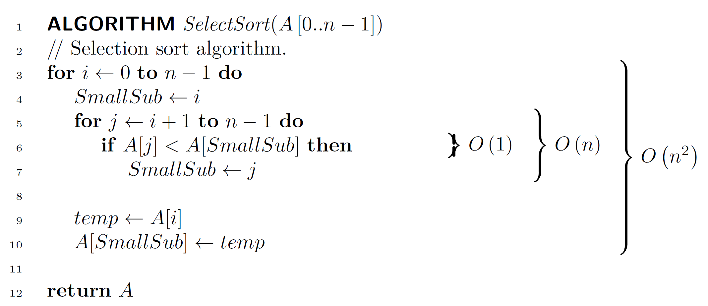

# Pseudocode to LaTeX

This repository provides a script to format Pseudocode using LaTeX.

## Requirements

### Programs

- [Python](https://www.python.org/downloads/)
- [LaTeX](https://www.latex-project.org/get/)

### Packages

For Python:

- [Pygments](https://pypi.org/project/Pygments/) --- For code tokenisation

For LaTeX:

- [minted](https://ctan.org/pkg/minted) --- For typesetting code listings
- [ti*k*Z](https://ctan.org/pkg/pgf) --- For drawing curly braces

## Getting Started

1. Copy `pseudocode-preamble.sty` and `Pseudocode.py` to your project directory.
2. Add the following line of code to the preamble of your `*.tex` file.

   ```tex
   \input{pseudocode-preamble.sty}
   ```

3. Place pseudocode in independent files with glob pattern `*.pseudo` or `*.pseudocode`,
   ensuring that filenames do not contain numbers. Place these code files inside a folder called `Pseudocode/`.
   (You may specify another directory by modifying the command in `pseudocode-preamble.sty`).
4. Place an `\input{<filename>.tex}` macro where you would like your code to appear.
5. Compile your program.
   - If a pseudocode file is modified or a new file is included, you must compile the document twice for all marker locations to be updated.

Note if you have not specified an `aux` directory, you will need to modify line 1 in `pseudocode-preamble.sty` and line 150 in `pseudocode.py`.

## Pseudocode Fie Conventions

Pseudocode can be placed in files with the glob pattern `*.pseudo` or `*.pseudocode`.

**Warning: file names cannot contain numbers. Special characters will be ignored.**

Recognised keywords are automatically formatted as **bold**.
All other text is formatted as plain text.

For typesetting mathematical expressions, operators, and variables, surround
text with dollar signs (`$`).

Comments are typeset as plain text, and can be invoked using double-forwardslashes (`//`).
These may be placed anywhere in the code.
To enter Math mode, place dollar signs within comments as previously stated.

For description braces, use the following syntax.

```bash
# Pseudocode
ALGORITHM AlgorithmName()
...

# The following code must be placed at the end of the file
# 1. Brace definitions (separate multiple definitions by a new line)
:{<level>}{<start line number>:<end line number>}<label>
# 2. Brace horizontal offsets
>{<initial offset>}{<additional offsets>}
```

- If 1. is omitted, 2. will be ignored and can also be omitted.
- If 1. is present, 2. must also be present.

### Brace Definition Guide

Specifying a `level` allows us to control the horizontal offset of braces that appear above other braces.

- Levels start at 0, and take positive integer values.

The distance between two levels is controlled by `initial offset` and `additional offsets`.

- Distances can be positive or negative floating point values.
- `additional offsets` must appear as comma separated values. If the number of supplied `additional offsets` is less than the maximum level,
  the program will automatically choose the last supplied offset.

For example:

```bash
...
:{0}{1:2}...
:{1}{2:3}...
:{2}{3:4}...
:{3}{4:5}...
>{7}{1.5, 1.0}
```

In the above code:

- Level 0 will be horizontally offset by 7cm (as specified).
- Level 1 will be horizontally offset by 7cm + 1.5cm (as specified).
- Level 2 will be horizontally offset by 7cm + 1.5cm + 1.0cm (as specified).
- Level 3 will be horizontally offset by 7cm + 1.5cm + 1.0cm + 1.0cm
  (the program chooses a 1.0cm offset for level 3 as it could not find a 3rd offset).

## Minimal Reproduceable Example

`Pseudocode/select-sort-A.pseudocode`:

```pseudocode
ALGORITHM SelectSort($A\left[0..n - 1\right]$)
// Selection sort algorithm.
for $i \leftarrow 0$ to $n - 1$ do
    $SmallSub \leftarrow i$
    for $j \leftarrow i + 1$ to $n - 1$ do
        if $A[j] < A[SmallSub]$ then
            $SmallSub \leftarrow j$

    $temp \leftarrow A[i]$
    $A[SmallSub] \leftarrow temp$

return $A$
:{0}{6:6}\(O\left( 1 \right)\)
:{1}{5:7}\(O\left( n \right)\)
:{2}{3:10}\(O\left( n^2 \right)\)
>{7}{1.5, 1.5}
```

Command-line (produces `.tex` file):

```bash
python Pseudocode.py Pseudocode
```

Within LaTeX:

```tex
%!TEX TS-program = xelatex
%!TEX options = -aux-directory=aux -shell-escape -interaction=nonstopmode -synctex=1 "%DOC%"
\documentclass{article}
\input{pseudocode-preamble.sty}

\setminted{linenos} % Style your minted environments here

\begin{document}
\input{Pseudocode/select-sort-A.tex}
\input{Pseudocode/select-sort-B.tex}
\end{document}
```

Note that if you are using the [LaTeX Workshop](https://marketplace.visualstudio.com/items?itemName=James-Yu.latex-workshop)
extension in VSCode, the magic comments (TeX directives) used in this example are disabled by default.
To enable them, please see [this issue](https://github.com/James-Yu/LaTeX-Workshop/issues/3027).

## Example Output



## Debugging

The provided script accepts both files and folders.

```bash
python Pseudocode.py <file | folder> [files | folders]...
```

This will generate a file within the same directory as the specified file with the `.tex` extension.

To optimise workflow, the above command has been placed within LaTeX using:

```tex
\immediate\write18{<command>}
```

where `<command>` is a shell command.

If the program does not produce the desired output, please check the output of the PseudocodeLexer in the `aux` directory.

Certain constants such as the output directory and the debugging flag can be modified from this file also. See line 149.
